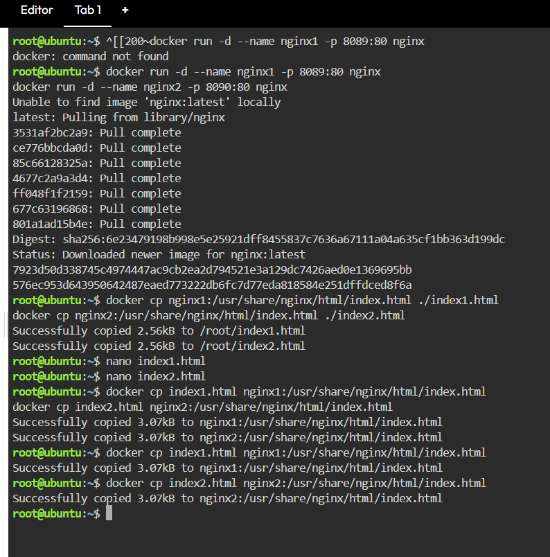
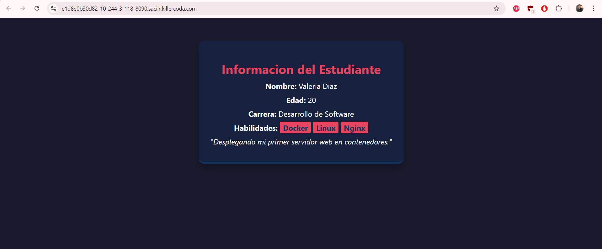
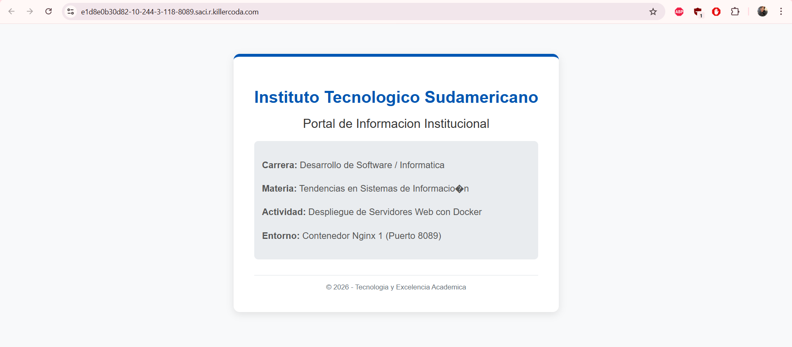

# Practica: Servidor Web Nginx con Docker
## 1. Titulo
Despliegue de servicios web escalables y personalización de contenido estático mediante contenedores Nginx y el comando Docker CP.

## 2. Tiempo de duración
60 minutos.

## 3. Fundamentos
La tecnología de contenedores ha transformado radicalmente la forma en que desarrollamos y desplegamos software. Docker es una plataforma de código abierto que automatiza el despliegue de aplicaciones dentro de contenedores de software, proporcionando una capa adicional de abstracción y automatización de virtualización a nivel de sistema operativo. A diferencia de las máquinas virtuales tradicionales, los contenedores no incluyen un sistema operativo completo; en su lugar, comparten el núcleo del sistema anfitrión, lo que los hace increíblemente ligeros, rápidos de iniciar y eficientes en el consumo de recursos.

En esta práctica, el componente central es Nginx, un servidor web de alto rendimiento, proxy inverso y balanceador de carga. Nginx es ampliamente preferido en la industria por su estabilidad, rica configuración y bajo consumo de memoria. Cuando ejecutamos Nginx en Docker, el servidor busca archivos HTML en una ruta interna específica (/usr/share/nginx/html/).

Un concepto clave para entender este ejercicio es el aislamiento del sistema de archivos. Aunque cada contenedor es una entidad aislada con su propio entorno, Docker ofrece herramientas para interactuar con ellos. El comando docker cp es fundamental en este aspecto, ya que permite copiar archivos o carpetas de forma bidireccional entre el sistema anfitrión (tu computadora o la terminal de Killercoda) y un contenedor en ejecución. Esto permite a los desarrolladores actualizar contenido o modificar configuraciones sin necesidad de entrar a la consola interna del contenedor ni reconstruir la imagen completa, optimizando los ciclos de trabajo.

Finalmente, el mapeo de puertos es lo que permite la comunicación externa. Dado que el contenedor tiene su propia red interna, mapeamos puertos del host (como el 8089) al puerto estándar 80 del contenedor, permitiendo que múltiples servidores web coexistan en la misma máquina física sin interferir entre sí.

## 4. Conocimientos previos
Para realizar esta práctica de manera exitosa, el estudiante debe poseer conocimientos en:

Comandos básicos de terminal Linux: Navegación de directorios (ls, cd) y gestión de archivos (rm, mkdir).

Edición de texto en consola: Uso fluido del editor nano para modificar archivos de configuración.

Manejo de navegadores web: Entendimiento de la barra de direcciones, IPs y puertos para la visualización de resultados.

Conceptos de Virtualización: Diferencia entre imagen, contenedor y host.

## 5. Objetivos a alcanzar
Implementar dos contenedores independientes basados en la imagen oficial de Nginx.

Configurar el mapeo de puertos personalizados (8089 y 8090) para el acceso externo.

Manipular archivos internos de un contenedor en ejecución utilizando el comando docker cp.

Personalizar la interfaz de usuario mediante la edición de archivos HTML y estilos CSS embebidos.

## 6. Equipo necesario:
Computador con conexión a internet y sistema operativo Windows/Linux/Mac.

Cuenta activa en Docker Hub (opcional para descarga de imágenes).

Entorno virtual de pruebas: Killercoda Ubuntu Playground.

Docker versión 20.10.x o superior instalado.

## 7. Material de apoyo.
Documentación oficial de Docker sobre comandos CLI.

Guía de la asignatura: Tendencias en Sistemas de Información.

Cheat sheet de comandos Linux para administración de servidores.

Tutorial de Nginx para gestión de contenido estático.

## 8. Procedimiento
Paso 1: Despliegue de los contenedores.
Se descargó la imagen oficial de Nginx y se crearon dos instancias aisladas con nombres descriptivos y mapeos de puertos únicos para evitar conflictos de red.

Bash
docker run -d --name nginx1 -p 8089:80 nginx
docker run -d --name nginx2 -p 8090:80 nginx
Paso 2: Extracción del contenido por defecto.
Se utilizó la utilidad de copia de Docker para extraer el archivo index.html original de cada contenedor hacia el sistema de archivos del anfitrión para su posterior edición.

Bash
docker cp nginx1:/usr/share/nginx/html/index.html ./index1.html
docker cp nginx2:/usr/share/nginx/html/index.html ./index2.html
Paso 3: Personalización de la información.
Se empleó el editor nano para modificar el contenido de los archivos. El archivo index1.html se configuró con los datos del Instituto Tecnológico Sudamericano, mientras que index2.html se personalizó con la información del estudiante.

Bash
nano index1.html
nano index2.html
Paso 4: Sincronización de los archivos modificados.
Se realizó la operación inversa de copia, enviando los archivos editados de vuelta a la ruta de despliegue de Nginx dentro de los contenedores correspondientes.

Bash
docker cp index1.html nginx1:/usr/share/nginx/html/index.html
docker cp index2.html nginx2:/usr/share/nginx/html/index.html
Figura 1-1. Diagrama de flujo de datos y manipulación de archivos entre Host y Contenedores.

## 9. Resultados esperados:
Se logró el despliegue de dos servidores web diferenciados. A continuación, se presentan las capturas de pantalla que validan el funcionamiento de los puertos 8089 (Institucional) y 8090 (Personal).

## 10. Bibliografía
Docker Inc. (2026). Docker Command Line Interface (CLI) Reference. Recuperado de https://docs.docker.com/engine/reference/commandline/cp/

Nginx, Inc. (2025). Beginner's Guide to Nginx Administration.

